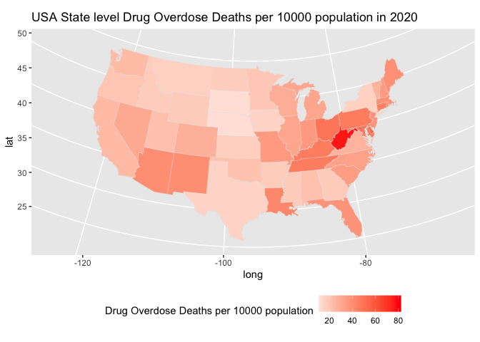
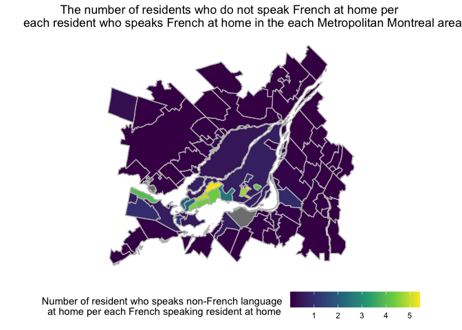

Week8-Assignment
================
Keisei\_Aoki
11/28/2021

## Part 1

``` r
library(tidyverse)
library(maps)
library(janitor)
```

``` r
us_states = map_data("state")
us_drug = read_csv("VSRR_Provisional_Drug_Overdose_Death_Counts.csv")
us_population = read_csv("PopulationReport.csv",show_col_types = FALSE)
us_population = us_population[1:56,1:6] %>%
  row_to_names(row_number = 3)
```

#### For the Map 1, I got 2 data.

#### First data is Provisional Number of Drug Overdose Deaths in the US, and I obtained data from <https://www.cdc.gov/nchs/nvss/vsrr/drug-overdose-data.htm>. The data tells how many people died from drug overdose every month in each state; the data was collected between 2015 April to 2021 April.

#### Second data I used was USA population data in 2020, and I obtained the data from <https://data.ers.usda.gov/reports.aspx?ID=17827> However, I could get it only in excel format. Therefore, I used Microsoft Excel to convert the data into CSV format. The data shows the population of the US and each state. Also, it tells changes in population size in percentage between 2010 and 2020. The population data were collected each decade from 1990 to 2020.

``` r
us_drug = us_drug %>% select(State,Year,Month,`State Name`,`Predicted Value`,Indicator) %>% filter(Indicator == "Number of Drug Overdose Deaths", Year != 2021, `State Name` != "United States" )
```

``` r
us_drug = us_drug %>% group_by(Year,`State Name`) %>%
            summarise(drug_death = sum(`Predicted Value`))
us_drug2 = us_drug %>% 
        filter(Year == 2020) %>%
        mutate(region = tolower(`State Name`))
```

``` r
us_population = us_population %>%
  select(Name,`Pop. 2020`) %>%
  mutate(`Pop. 2020` = as.numeric(str_remove_all(`Pop. 2020`,",")),
         region = tolower(Name))
```

``` r
us_drug3 = us_drug2 %>% left_join(us_population,by="region") %>%
          mutate(death_per_10000 = 10000*(drug_death / `Pop. 2020`))

drug_map  = us_states %>% left_join(us_drug3,by="region")
```

``` r
p0 = ggplot(data = drug_map, mapping=aes(x = long, y = lat,
      group = group, fill = death_per_10000))
p1 = p0 + geom_polygon(color="grey90",size = 0.1) +
     coord_map(projection = "albers",lat0 = 39, lat1=45)

p2 = p1 + scale_fill_gradient2(low = "white",high = "red") +
  labs(title = "USA State level Drug Overdose Deaths per 10000 population in 2020",fill="Drug Overdose Deaths per 10000 population") + theme(legend.position ="bottom") 
p2
```

<!-- -->

#### According to the map and data, West Virginia and the District of Columbia have an outstanding rate of Drug overdose death, which is around 80 per 10000 population in the states. Delaware has the third-highest death rate due to drug overdose, but about 56 per 10000 population.

#### Also, the map tells there are not many drug overdose death cases in the “West” relative to other regions. On the other hand, states near West Virginia tend to have high death cases due to drug overdose, which are the Eastern part of Midwest, Southern part of NorthEast and North part of the SouthEast. There are not many other clear regional patterns of drug overdose death in the US.

## Map2

``` r
library("cancensus")
library("sf")
library("geojsonsf")
```

``` r
## setting API
options(cancensus.api_key = "CensusMapper_b7c75dff4cc52fd36a7f8ec54d1d8780")
options(cancensus.cache_path = "custom cache path")
readRenviron("~/.Renviron")
```

``` r
list_census_datasets()
list_census_regions('CA16') %>%
  filter(level == "CMA", name == "Montréal")
census_data_2016 <- get_census(dataset='CA16', regions=list(CMA="24462"),
                               vectors=c("v_CA16_1371","v_CA16_1368","v_CA16_1365"),
                               level='CSD', use_cache = FALSE, geo_format = 'sf')  %>%                                                  select(GeoUID,geometry,`Region Name`,Population,`v_CA16_1368: French`, `v_CA16_1371: Non-official languages`,`v_CA16_1365: English`)

census_2016  = census_data_2016 %>%
          mutate(fre_ratio =  (`v_CA16_1365: English` +  `v_CA16_1371: Non-official languages`) / `v_CA16_1368: French`)
```

``` r
census_2016 %>% 
  ggplot(aes(geometry=geometry)) + 
  geom_sf(aes(fill = fre_ratio), colour = "gray") +
  scale_fill_viridis_c(option = "viridis", "Number of resident who speaks non-French language 
  at home per each French speaking resident at home") + 
  theme_minimal() +
  theme(legend.position ="bottom",legend.key.width = unit(1, 'cm'),
        plot.title = element_text(hjust = 0.5)) +
  coord_sf(datum=NA) +
  labs(title = "The number of residents who do not speak French at home per 
       each resident who speaks French at home in the each Metropolitan Montreal area")
```

<!-- -->

#### The map tells a number of residents who do not speak French at home per each resident who speaks French at home in each district of the Metropolitan Montreal. The numbers are high in districts on the Island of Montreal, and the ratio of people who do not speak French at home decreases as the district is far away from the island. The exception of this trend is Hudson’s district, which has nearly four people per resident who speak French at home.

#### Also, the graph tells people with non-French backgrounds live on certain parts of the Island of Montreal. They tend to live on South West side of the Island of Montreal and districts near Montreal downtown. This tells there might be a relationship between the location of Montreal Airport plus downtown and the number of people who have a non-French background. However, it’s not clear from this map.
